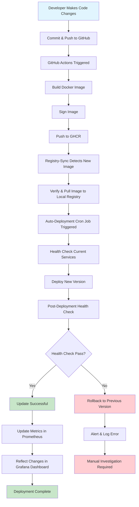

# DevOps Assessment Project

This project demonstrates a complete DevOps pipeline with automated deployment, monitoring, and container orchestration for a robot application system.

## Project Structure

```
├── docker-compose.infrastructure.yml  # Infrastructure services (Prometheus, Grafana, Registry)
├── docker-compose.robots.yml         # Robot application services
├── manage-services.sh                # Service management script
├── robot/                            # Robot application source code
│   ├── app.py                       # Flask application with metrics
│   ├── Dockerfile                   # Robot app container definition
│   ├── requirements.txt             # Python dependencies
│   └── templates/
│       └── index.html               # Web interface template
├── monitoring/                       # Monitoring stack configuration
│   ├── prometheus1.yml              # Primary Prometheus config
│   ├── prometheus2.yml              # Secondary Prometheus config
│   ├── README.md                   # Monitoring setup guide
│   └── grafana/                    # Grafana dashboards and config
│       ├── dashboards/
│       └── provisioning/
├── local-registry/                  # Docker registry setup
│   ├── Dockerfile                  # Registry sync container
│   ├── entrypoint.sh               # Registry initialization script
│   ├── sync-images.sh              # Image synchronization script
│   └── README.md                   # Registry setup guide
└── updater/                        # Auto-deployment system
    ├── auto-deploy.sh               # Main deployment automation script
    ├── deploy-helper.sh             # User-friendly deployment commands
    ├── test-deployment.sh           # Deployment system testing
    ├── deploy-config.conf           # Configuration settings
    └── README-deployment.md         # Detailed deployment guide
```

## Components

### 🤖 Robot Application
- **Location**: `robot/`
- **Description**: Flask-based web application with Prometheus metrics
- **Features**: Health checks, metrics export, containerized deployment
- **Ports**: 5001-5003 (for robot-service-1, robot-service-2, robot-service-3)

### 📊 Monitoring Stack
- **Location**: `monitoring/`
- **Components**: 
  - Prometheus (dual instance setup)
  - Grafana with pre-configured dashboards
- **Features**: Multi-target scraping, high availability, automated provisioning
- **Ports**: 9090 (Prometheus-1), 9091 (Prometheus-2), 3000 (Grafana)

### 🗂️ Local Registry
- **Location**: `local-registry/`
- **Description**: Private Docker registry with GitHub integration
- **Features**: Image synchronization, automated pulls from GitHub packages
- **Port**: 5000

### 🔄 Auto-Deployment System
- **Location**: `updater/`
- **Description**: Automated deployment pipeline with health checks and rollback
- **Features**: 
  - Registry monitoring for new images
  - Zero-downtime deployments
  - Health verification
  - Automatic rollback on failures
  - Continuous monitoring and logging

## Quick Start

**Prerequisites**: A Linux-based VM with the latest versions of Docker and Docker Compose installed.

1) Clone the repository and push it to your own GitHub account so that you can run workflows within it.

2) Run the `Build Robot App` workflow. This will build the image, sign it, and push it to the repository's GitHub Container Registry (GHCR).

3) Update the `GITHUB_REPOSITORY` variable in the `.env` file accordingly.

4) On the VM, run `./manage-services.sh start-infra`. This will spin up the following 5 containers on the same VM for demonstration purposes:

   These two containers can be deployed anywhere on-premises or third-party cloud to serve fleet monitoring:
   - **grafana** - Monitoring dashboard
   - **prometheus-1** - Primary metrics storage
   
   The following three containers are typically deployed on a Gateway VM:
   - **prometheus-2** - Collects metrics from robots, caches them, and pushes to main prometheus-1 when internet is available
   - **local-registry** - Stores and serves Docker images locally
   - **registry-sync** - Verifies and pulls images from GHCR when internet is available
   
   You can now access Grafana at `<VM IP>:3000` (username: admin, password: admin).
   Navigate to the dashboard where you will see data for three dummy robots, which will show as unhealthy since we haven't started the robot services yet.

5) Check the logs of registry-sync using `docker logs registry-sync`. When you see it has successfully pulled image tags from GHCR, proceed to the next step.

6) Run `./manage-services.sh start-robots`. This will start three dummy robot services: robot-service-1, robot-service-2, and robot-service-3.
   
   You can now access the web pages of the dummy robot services at `<VM IP>:5001-5003`. A simple web page will display showing details about the robot firmware.
   
   When you return to the Grafana Dashboard, you should see all three robots online and healthy.

7) Run `cd updater && ./deploy-helper.sh setup`. This will set up a cron job on the VM that runs every 5 minutes to check for new robot images in the local registry. When available, it will initiate the update process for robot services. For more details, see `updater/README-deployment.md`.

The entire setup and automation is now in place. Simply go to GitHub Actions and run the workflow again, this time with a different tag (e.g., 0.0.2). Once the new image is signed and pushed to GHCR, the registry sync on the gateway VM will verify and pull the image. Then the auto-updater cron job will retrieve the new tagged image from the local registry and update all robot services. You will be able to see the updated versions on the Grafana Dashboard.

## Development Workflow

### 1. Code Changes
1. Make changes to robot application code
2. Commit and push to GitHub repository
3. GitHub Actions builds and pushes new image
4. Registry-sync pulls new image to local registry
5. Auto-deployment system detects and deploys new version

### 2. Monitoring and Verification
1. Check Grafana dashboards for deployment metrics
2. Verify robot services health status
3. Monitor Prometheus for application metrics
4. Review deployment logs for any issues



## Configuration

### Service Configuration
- **Prometheus**: Configure scraping targets in `monitoring/prometheus*.yml`
- **Grafana**: Modify dashboards in `monitoring/grafana/dashboards/`
- **Deployment**: Adjust settings in `updater/deploy-config.conf`
- **Infrastructure Services**: Managed via `docker-compose.infrastructure.yml`
- **Robot Services**: Managed via `docker-compose.robots.yml`