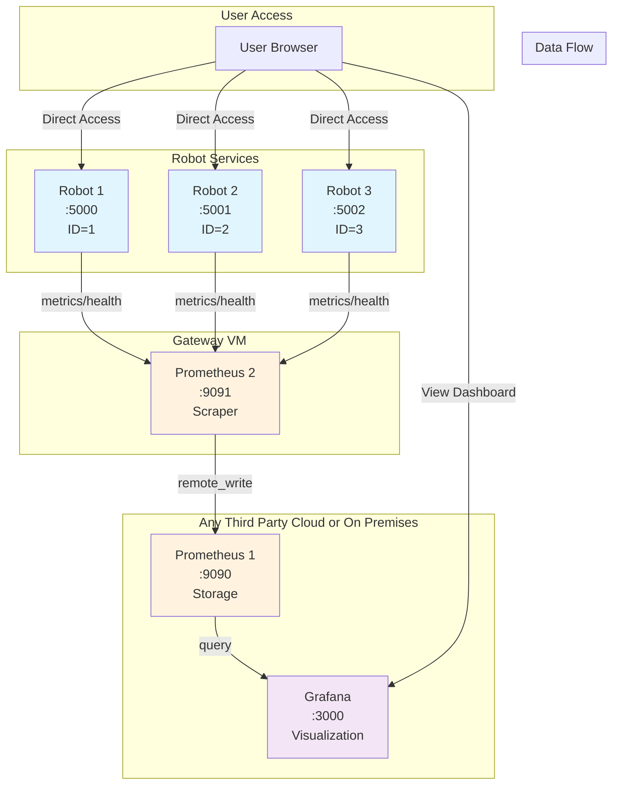

# Robot Monitoring Infrastructure

This document describes the complete monitoring setup for the Robot DevOps Assessment project, featuring a multi-service architecture with Prometheus-based metrics collection and Grafana visualization.

## 🏗️ Architecture Overview



## 📊 Component Details

### Robot Services
Each robot service is a containerized Flask application that:
- **Exposes metrics** at `/metrics` endpoint (Prometheus format)
- **Health checks** available at `/health` endpoint
- **Web interface** at root `/` showing robot status
- **Unique identification** via `ROBOT_ID` environment variable

**Metrics Exposed:**
- `robot_health_status{robot_id}` - Health status (1=healthy, 0=unhealthy)
- `robot_info{robot_id,version,status}` - Robot information labels
- `robot_version{robot_id,version}` - Version information
- `robot_requests_total{endpoint,robot_id}` - HTTP request counters

### Prometheus 2 (Scraper - on Gateway VM)
- **Port**: 9091
- **Role**: Metrics collection from all robot services
- **Scrape interval**: 10 seconds
- **Targets**: All robot services on ports 5000-5002
- **Remote write**: Forwards collected metrics to Prometheus 1

### Prometheus 1 (Storage - on any third party cloud or on premises)
- **Port**: 9090
- **Role**: Central metrics storage and query engine
- **Features**: 
  - Remote write receiver enabled
  - Data retention: 15 days / 512MB
  - Query interface for Grafana

### Grafana (Visualization - - on same as above third party cloud or on premises)
- **Port**: 3000
- **Credentials**: admin/admin
- **Auto-provisioned**: Datasources and dashboards
- **Dashboard**: "Robot Metrics Dashboard" with 4 panels

## 🚀 Quick Start

### Prerequisites
- Docker and Docker Compose

### Deployment
```bash
# Clone and navigate to project
cd /path/to/Devops-assessment

# Start all services
docker compose up --build -d

# Verify deployment
docker ps
```

### Service Access
| Service | URL | Purpose |
|---------|-----|---------|
| Robot 1 | http://localhost:5000 | Robot web interface |
| Robot 2 | http://localhost:5001 | Robot web interface |
| Robot 3 | http://localhost:5002 | Robot web interface |
| Prometheus 1 | http://localhost:9090 | Metrics storage & queries |
| Prometheus 2 | http://localhost:9091 | Metrics scraping |
| Grafana | http://localhost:3000 | Monitoring dashboard |

## 📈 Dashboard Panels

### 1. All Robots Health Status
- **Type**: Stat panel
- **Query**: `sum(robot_health_status) by (robot_id)`
- **Display**: Shows health status for each robot (Healthy/Unhealthy)

### 2. All Robots Information
- **Type**: Table panel  
- **Query**: `robot_info`
- **Display**: Table with robot_id, version, status columns

### 3. HTTP Requests Rate
- **Type**: Time series panel
- **Query**: `sum(rate(robot_requests_total[5m])) by (endpoint, robot_id)`
- **Display**: Request rate graphs by endpoint and robot

## 🔧 Configuration Files

### Key Configuration Files
```
monitoring/
├── prometheus1.yml          # Storage Prometheus config
├── prometheus2.yml          # Scraper Prometheus config  
├── grafana/
│   ├── provisioning/
│   │   ├── datasources/
│   │   │   └── prometheus.yml
│   │   └── dashboards/
│   │       └── dashboard.yml
│   └── dashboards/
│       └── robots.json      # Main dashboard definition
```

### Robot Scaling
To add more robots, update two files:

**1. docker-compose.yml**
```yaml
robot-4:
  build:
    context: ./robot
    dockerfile: Dockerfile
  container_name: robot-service-4
  ports:
    - "5003:5000"
  environment:
    - ROBOT_ID=4
    - APP_VERSION=1.0.0
  # ... other config
```

**2. monitoring/prometheus2.yml**
```yaml
- job_name: 'robots'
  static_configs:
    - targets: 
        - 'robot-service:5000'
        - 'robot-service-2:5000'
        - 'robot-service-3:5000'
        - 'robot-service-4:5000'  # Add new robot
```

## 🔍 Monitoring Queries

### Useful Prometheus Queries
```promql
# All healthy robots
sum(robot_health_status)

# Robot uptime per service  
up{job="robots"}

# Request rate by robot
sum(rate(robot_requests_total[5m])) by (robot_id)

# Health status by robot
robot_health_status{robot_id="1"}
```

## 🛠️ Troubleshooting

### Common Issues

**Dashboard not showing data:**
- Check if all services are running: `docker ps`
- Verify Prometheus targets: http://localhost:9091/targets
- Check robot metrics: http://localhost:5000/metrics

**Robots not healthy:**
- Check container logs: `docker logs robot-service`
- Verify health endpoint: `curl http://localhost:5000/health`

**Prometheus not scraping:**
- Restart Prometheus 2: `docker restart prometheus-2`
- Check network connectivity between containers
- Verify prometheus2.yml configuration

### Logs Access
```bash
# View service logs
docker logs robot-service
docker logs prometheus-1  
docker logs prometheus-2
docker logs grafana

# Follow logs in real-time
docker logs -f robot-service
```

## 📝 Development

### Adding New Metrics
1. Update `robot/app.py` to expose new metrics
2. Rebuild robot containers: `docker compose up --build robot`
3. Add new panels to Grafana dashboard
4. Update this documentation

### Testing Changes
```bash
# Rebuild specific service
docker compose up --build -d robot

# Restart monitoring stack
docker restart prometheus-2 grafana

# Check metrics collection
curl -s http://localhost:9090/api/v1/query?query=robot_health_status
```

## 🏷️ Version Information
- **Architecture**: Multi-service Prometheus monitoring
- **Robot Services**: Flask-based with Prometheus metrics
- **Data Flow**: Prometheus 2 → Prometheus 1 → Grafana
- **Scaling**: Static configuration for known robot count
- **Dashboard**: Auto-provisioned with 3 monitoring panels

---
*This monitoring setup provides comprehensive observability for robot fleet management with real-time health monitoring, metrics collection, and visualization capabilities.*